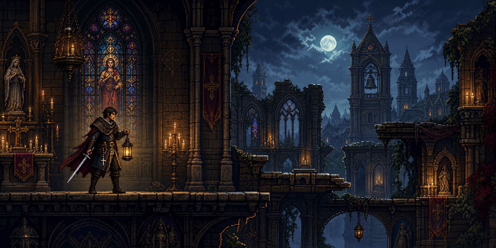
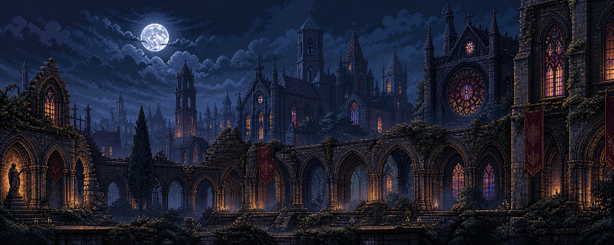

<div align="center">



# ✠ Pilgrim of the Thorn

### A Catholic gothic action-platformer of prayer, relic, and blade.

_Walk through ruined cloisters, moonlit belfries, and candle-bright chapels<br>
as a pilgrim-knight enters a city that has forgotten grace._

<p>
  
  
  
  
</p>

[Build the game](#build-the-game) · [Explore the project](#inside-the-abbey) · [Run the website](#the-website) · [Tune animations](#animation-workbench) · [Code style](STYLE_GUIDE.md)

</div>

---

## The vow

**Pilgrim of the Thorn** is a playable proof of concept built in C with OpenGL and GLUT. It reaches for the deliberate movement of classic gothic platformers while grounding its world in Catholic material culture: relics, confession, sacred architecture, candlelight, and the stubborn presence of beauty amid ruin.

This is not dark fantasy with incense painted over it. The Church shapes the world.

| Relics have weight                                                                | Prayer is defiance                                                            | Beauty still wounds                                                                  |
| :-------------------------------------------------------------------------------- | :---------------------------------------------------------------------------- | :----------------------------------------------------------------------------------- |
| Holy objects are memory, obligation, and the presence of saints in a city of ash. | Candlelight, chant, and confession resist decay as surely as sharpened steel. | Stained glass and carved stone are signs that even ruin can be ordered toward glory. |

<br>



## The pilgrimage

The current prototype is a side-scrolling journey through layered cathedral ruins, reliquary alcoves, ivy-wrapped arches, moonlit towers, and pools of votive gold.

- Fast ground acceleration with restrained air control
- Variable jump height and gravity-heavy falls
- Short backdash for deliberate spacing
- Committed sword strikes with readable timing
- A smooth side-scrolling camera across several screens
- Authored idle, walk, jump, slash, and dash animation states
- Live sprite placement and trim tools for visual tuning

> The hero is not a swaggering demon hunter. He is a penitent with a lantern.

## Controls

| Action                  | Keyboard                                     |
| :---------------------- | :------------------------------------------- |
| Walk                    | `A` / `D` or arrow keys                      |
| Jump                    | `Space`, `W`, or ↑ — hold briefly for height |
| Sword slash             | `J`                                          |
| Backdash                | `K`                                          |
| Return to the beginning | `R`                                          |
| Leave the pilgrimage    | `Esc`                                        |

## Build the game

### macOS

The native build uses the OpenGL, GLUT, Cocoa, Core Graphics, and ImageIO frameworks included with macOS.

```sh
make
make run
```

Useful commands:

```sh
make tune            # Run with the live animation-tuning overlay
make package-macos   # Build a versioned app, DMG, and zip
./build/pilgrim --version
```

Packaged releases are written to `dist/macos/`:

```text
Pilgrim-of-the-Thorn-macOS-v0.0.1.dmg
Pilgrim-of-the-Thorn-macOS-app-v0.0.1.zip
```

The semantic version lives in [`VERSION`](VERSION). Changing it rebuilds the executable and carries the same version into the app bundle, downloadable DMG, zip archive, and website.

### Linux

Install a C compiler, OpenGL development libraries, and FreeGLUT, then run:

```sh
make
make run
```

## The website

The companion landing page translates the same world into parchment, gold, cathedral blue, and deep night. It is built with Vite and TypeScript and served by a Cloudflare Worker.

```sh
npm --prefix web install
npm --prefix web run dev
```

The site sync step draws directly from the game:

- Concept and background art are copied from `assets/`
- The walk cycle is chroma-keyed for presentation
- The current versioned macOS DMG is copied into the download area
- `/api/download` redirects to the matching release artifact

To build the game, package the current release, build the site, and deploy:

```sh
npm run deploy
```

Wrangler authentication and Cloudflare access are required for deployment.

## Inside the abbey

```text
.
├── assets/              Source art, sprite sheets, and tuning data
├── scripts/             Packaging and animation-analysis tools
├── src/main.c           Game, renderer, physics, and tuning interface
├── web/
│   ├── scripts/         Asset synchronization
│   ├── src/             Landing page and visual system
│   └── worker/          Download routing
├── Makefile             Native build and analysis commands
└── VERSION              Shared semantic version
```

The prototype intentionally keeps its native heart compact: the game is currently implemented in a single C source file, with supporting shell and Python tools around it for packaging and animation review.

## Animation workbench

Run the game in tuning mode to adjust sprite placement while the actual movement, attacks, and camera are active:

```sh
make tune
```

Tuning values load from `assets/pilgrim_tuning.txt`.

| Key                | Tuning action                           |
| :----------------- | :-------------------------------------- |
| `1`–`5`            | Select idle, walk, jump, slash, or dash |
| `[` / `]`          | Select previous or next animation frame |
| Arrow keys         | Nudge the selected frame                |
| `Shift` + arrows   | Fine 0.1-unit nudges                    |
| `Control` + arrows | Coarse 2-unit nudges                    |
| `T`                | Toggle source-image trim mode           |
| `+` / `-`          | Scale width and height                  |
| `Z` / `X`          | Shrink or grow width                    |
| `C` / `V`          | Shrink or grow height                   |
| `O`                | Restore the selected frame's defaults   |
| `S`                | Save all tuning tables                  |
| `L`                | Reload tuning from disk                 |
| `P`                | Print and export C tuning declarations  |

For a frozen frame bench:

```sh
PILGRIM_TUNE=1 PILGRIM_ISOLATE_PLAYER=1 ./build/pilgrim
```

Optional environment controls include:

```sh
PILGRIM_TUNE_ANIM=idle|walk|jump|slash|dash
PILGRIM_TUNE_FRAME=0..N
PILGRIM_FORCE_FACING=-1|1
PILGRIM_TUNE_FILE=/path/to/pilgrim_tuning.txt
PILGRIM_TUNE_EXPORT=/path/to/tables.c
```

## Visual review tools

The repository includes repeatable capture and analysis passes for checking the authored animation:

| Command                    | Purpose                                                       |
| :------------------------- | :------------------------------------------------------------ |
| `make check-animations`    | Capture the primary states and detect chroma-green leaks      |
| `make analyze-idle`        | Check planted feet, baseline, and body-center drift           |
| `make analyze-walk`        | Check contact, raised steps, baseline, and center drift       |
| `make observe-walk`        | Produce a timed walk strip for frame-by-frame review          |
| `make review-walk`         | Render a loop, contact sheet, onion skin, guides, and metrics |
| `make analyze-jump`        | Check drift, margins, and chroma-key leaks                    |
| `make analyze-proportions` | Compare scale and centerlines across all states               |

Scripted captures can be driven with environment variables:

```sh
PILGRIM_SCRIPT=walk PILGRIM_CAPTURE_FRAME=90 \
PILGRIM_CAPTURE=/tmp/pilgrim-frame.ppm make run
```

Telemetry is also available:

```sh
PILGRIM_SCRIPT=jump \
PILGRIM_TELEMETRY=/tmp/pilgrim.tsv make run
```

<details>
<summary><strong>Authored art pipeline</strong></summary>

The runtime and website share the same source material:

- `cathedral_background.png` — parallax cathedral environment
- `midground_sheet_source.png` — bell tower and ruined cloister atlas
- `foreground_sheet_source.png` — foreground atlas, chroma-keyed at runtime
- `pilgrim_sheet_expanded_source.png` — action-sheet fallback
- `pilgrim_idle_breath_source.png` — six-frame planted breathing cycle
- `pilgrim_walk_cycle_source.png` — four-frame authored walk cycle
- `pilgrim_tuning.txt` — live placement and trim values

Individual authored frames can be selected with `PILGRIM_FORCE_IDLE_FRAME`, `PILGRIM_FORCE_WALK_FRAME`, or `PILGRIM_FORCE_JUMP_FRAME`.

</details>

---

<div align="center">

### The bell is still ringing.

**Take up the lantern.**

</div>
